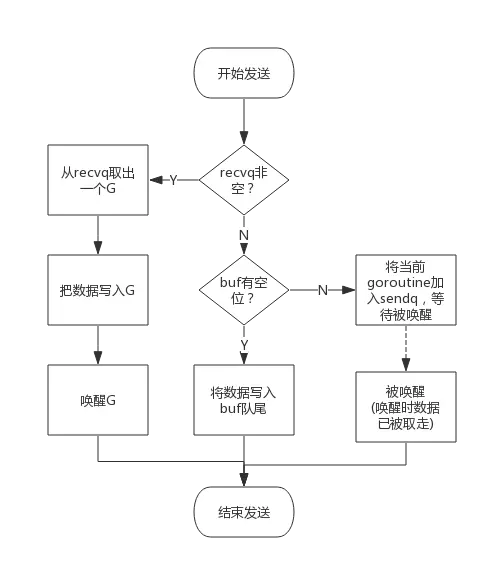
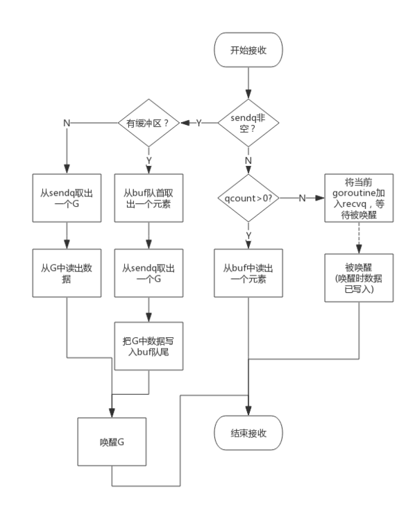

```golang
type hchan struct {
	// chan 里元素数量
	qcount   uint
	// chan 底层循环数组的长度，> 0表示有缓冲，= 0表示无缓冲
	dataqsiz uint
	// 指向底层循环数组的指针
	// 只针对有缓冲的 channel
	buf      unsafe.Pointer
	// chan 中元素大小
	elemsize uint16
	// chan 是否被关闭的标志
	closed   uint32
	// chan 中元素类型
	elemtype *_type // element type
	// 队列下标，指示元素写入时存放到队列中的位置
	sendx    uint   // send index
	// 队列下标，指示元素从队列的该位置读出
	recvx    uint   // receive index
	// 当前等待从 channel 接收数据的 G 的链表
	recvq    waitq  // list of recv waiters
	// 当前等待发送数据到 channel 的 G 的链表
  sendq    waitq  // list of send waiters (pop todo g)

	// 保护 hchan 中所有字段
	lock mutex
}
```


## 理解

- buf + recvx: 存放channel数据的环形队列（基于数组）

  buf环形队列是满的时候*sendx等于*recvx

- 队列：队列容量、使用量、队列大小、元素类型、是否关闭

- 链表（recvq和sendq）：接收链表、发送链表（单享队列），用于保存阻塞在此channel的goroutine
  
  `recvq`和`sendq`分别是接收(<-channel)或者发送(channel <- xxx)的goroutine抽象出来的结构体(sudog)的队列
  recvq队列, 读等待队列
  
  sendq队列，写等待队列
  
- lock 互斥锁

- 通信：数据传递依赖于内存拷贝hchan

- channel的阻塞是通过goroutine自己挂起，唤醒goroutine是通过对方goroutine唤醒实现的。

- 无缓冲的channel始终都是直接访问对方goroutine内存的方式






## 阻塞goroutine唤醒


协程间的通信，**select的使用**