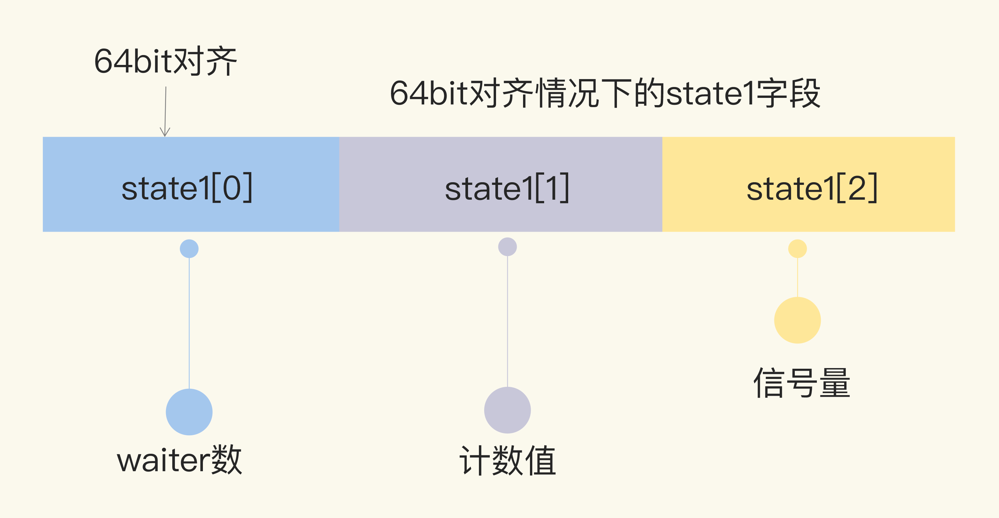

## 背景：

#### 目的：

1. `WaitGroup` 用作简单的同步处理
2. 减少内存的使用
3. 一个 WaitGroup 对象可以等待一组协程结束


## 使用方法

1. main协程通过调用 `wg.Add(delta int)` 设置worker协程的个数，然后创建worker协程；
2. worker协程执行结束以后，都要调用 `wg.Done()`；
3. main协程调用 `wg.Wait()` 且被block，直到所有worker协程全部执行结束后返回。


## 说明：

`WaitGroup` 对象内部有一个计数器，最初从0开始，它有三个方法：`Add(), Done(), Wait()` 用来控制计数器的数量。`Add(n)` 把计数器设置为`n` ，`Done()` 每次把计数器`-1` ，`wait()` 会阻塞代码的运行，直到计数器地值减为0。

```
func main() {
    wg := sync.WaitGroup{}
    wg.Add(100)
    for i := 0; i < 100; i++ {
        go func(i int) {
            fmt.Println(i)
            wg.Done()
        }(i)
    }
    wg.Wait()
}
```


## 注意事项

#### 1. 计数器不能为负值

我们不能使用`Add()` 给`wg` 设置一个负值

#### 2. WaitGroup对象不是一个引用类型

WaitGroup对象不是一个引用类型，在通过函数传值的时候需要使用地址：

```
func main() {
    wg := sync.WaitGroup{}
    wg.Add(100)
    for i := 0; i < 100; i++ {
        go f(i, &wg)
    }
    wg.Wait()
}

// 一定要通过指针传值，不然进程会进入死锁状态
func f(i int, wg *sync.WaitGroup) { 
    fmt.Println(i)
    wg.Done()
}
```


## 原理

在 64 位环境下，state1 的第一个元素是 waiter 数，第二个元素是 WaitGroup 的计数值，第三个元素是信号量。




 waiter ：等待值

 waiterGroup总数

信号量：wg 是通过信号量来通知的

